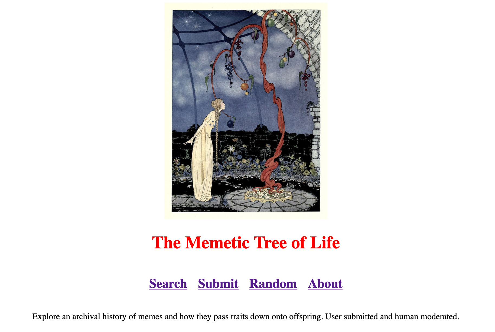

# Memetic Tree

The goal of this project is to provide very efficient image storage while also generating interesting anthropological statistics based off of submitted content. And, to have fun!

## Tech Stack:
- Store images as avif, super compressed, with jpg as a hot cache for frequent images
- gen2brain/jpegli + gen2brain/avif for compression 
- sqlite for managing lookups, relations (mattn/go-sqlite3)
- go to manage backend and statistics, user upload
- a-h/templ for managing front end parts
- podman for containerization (if needed?)

## How trees are organized:
- Each meme has ancestors and offspring.
- Memes can have multiple ancestors and multiple offspring.
- Individual offspring are referred to as `variants`.
- The original ancestor in a tree, with no other ancestors, is referred to as a `LUCA`. 
- `LUCA`s are dynamically updated as new data is added, since new ancestors will be discovered over time.

## Build:
- For Webserver:
    - Enter webserver directory 
    - Build templ files with: `go tool templ generate`
    - Run with `go run .`
- It is highly recommended to install the templ vscode extension if you are going to be working with the frontend, since templ files can be messy.